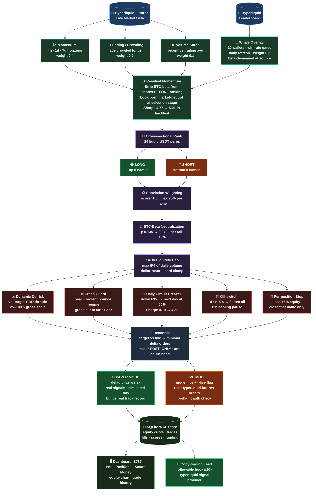
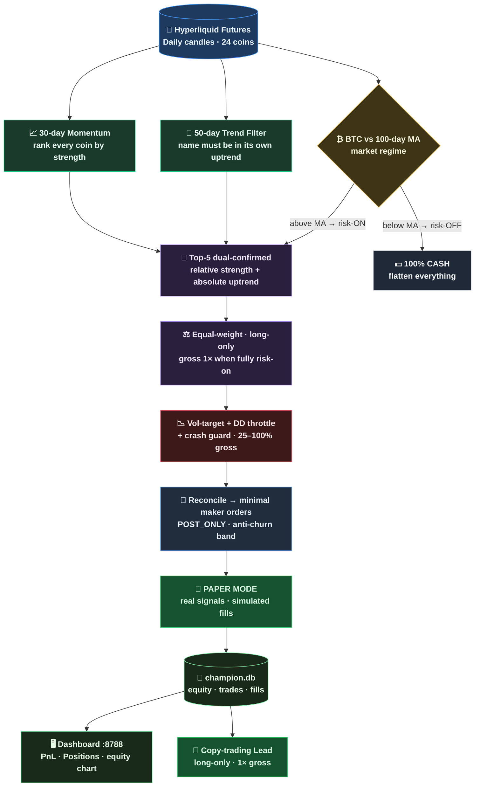
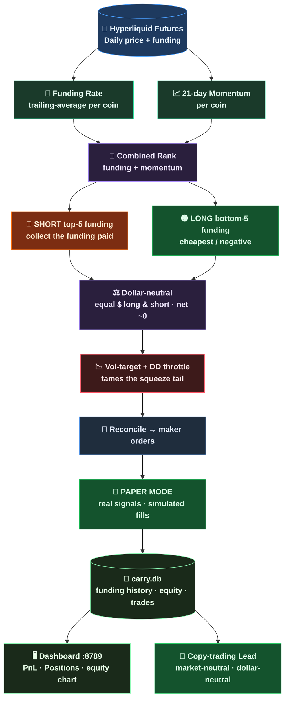

# Sentinel Edge — Hyperliquid Copy-Trading Bot

[](https://github.com/adensvaz/Sentinal_Hyperliquid/actions/workflows/ci.yml)
[](LICENSE)
[](pyproject.toml)
[](#)
[](#)

> **Three** uncorrelated algorithmic crypto-futures strategies on **Hyperliquid**, sharing one engine.
> Modeled on Gamma's **Sentiment Edge** vault. Goal: become a **copy-trading lead** (signal provider).

| | ⚖ **Market-Neutral** | ⚡ **Momentum + Regime** *(Champion)* | 💰 **Funding Carry** |
|---|---|---|---|
| **Idea** | Long the strong, short the weak — ~zero market exposure | Ride the 5 strongest coins; go to cash when BTC turns down | Short high-funding coins / long low-funding; collect the carry |
| **Profits from** | *Which* coins beat which (relative) | The market's strongest trends (directional) | The structural funding premium (income) |
| **Risk** | Low — ~13% DD, BTC-β ≈ 0.07 | Higher — ~32% DD | Medium — ~28% DD (with overlay) |
| **Backtest edge** | Thin long-run (Sharpe ~0.06, 5.5yr clean) | **Validated** — Sharpe ~1.3, +39-74%/yr, 5.5yr | **Validated** — Sharpe ~2.0, +123%/yr, 6.5yr, every year green |
| **Best for** | Capital preservation, low stress | Maximum growth, can stomach swings | Best risk-adjusted return; a diversifier |

All four run **side-by-side in paper**, each with its own database, rebalance loop, and dashboard — and they are **mutually uncorrelated** (carry vs the others ≈ 0), so the combined book is smoother than any one alone. The same data feed, execution path, and risk rails serve all four.

> 📈 **New — Trend (CTA).** A dollar-neutral cross-sectional trend-following book: longs the coins in the strongest uptrends, shorts the strongest downtrends (price vs its 30-day MA). Trend-following is the most durable systematic edge in finance — validated on **5 years of daily data (Sharpe ~1.35 · +75%/yr · positive every full year)**, with the vol-target / drawdown-throttle overlay taming the raw ~44% drawdown. **Replaces the retired Funding-Alpha**, whose pure-funding edge decayed to a 5yr Sharpe of 0.38. Paper-only until it proves out live.

## 🔴 Live Dashboards

| Strategy | Dashboard | The book |
|---|---|---|
| ⚖ Market-Neutral | **▶ [34.60.251.66:8787](http://34.60.251.66:8787)** | steady, market-proof |
| ⚡ Momentum *(Champion)* | **▶ [34.60.251.66:8788](http://34.60.251.66:8788)** | directional, regime-gated growth |
| 💰 Funding Carry | **▶ [34.60.251.66:8789](http://34.60.251.66:8789)** | market-neutral funding income |
| 📈 Trend *(CTA)* | **▶ [34.60.251.66:8790](http://34.60.251.66:8790)** | dollar-neutral trend-following, Hyperliquid |

Each has a **Dashboard** tab (live PnL, equity curve, open positions) and a **How it works** tab (animated, strategy-aware walkthrough). Running 24/7 on Google Cloud.

> Read-only display of **paper** (simulated) accounts — no live funds, no API keys exposed.

---

## Architecture

Both strategies share the same five-layer engine (signal → portfolio → risk → execution → state) and differ only in the **signal + portfolio** layers. The diagrams below show each book end-to-end.

### Strategy 1 — ⚖ Market-Neutral (long/short, dollar-neutral)



### Strategy 2 — ⚡ Momentum + Regime (Champion · long-only, directional)

The validated 5.5-year edge. It keeps crypto's beta (the long backtest proved that's where the durable edge lives) but **gates it with a BTC-regime brake**: hold the strongest names only while the market trends up, otherwise sit in cash.



### Strategy 3 — 💰 Funding Carry (market-neutral, income)

Harvests the **structural funding premium** — perpetual funding is a payment from crowded longs to shorts. Dollar-neutral and orthogonal to price; the momentum tilt tames the classic short-squeeze tail. Uncorrelated to the other two books (corr ≈ 0) — a genuine diversifier.



---

## Backtest Results

### 💰 Funding Carry — the best risk-adjusted edge (and a diversifier)

**6.5 years** of real Binance funding history + daily prices, dynamic universe, **look-ahead-free** and fee-tested.

| Metric | Value |
|---|---|
| CAGR | **+123%/yr** (production code, through risk overlay) |
| Sharpe ratio | **2.05** |
| Max drawdown | ~28% (raw ~56%; overlay tames it) |
| Worst-half Sharpe | 1.56 |
| Consistency | **positive every year 2020-2026** |
| Robustness | Sharpe >0.5 in **96%** of random coin-universes; survives fees to 25 bps |
| Correlation | ≈ **0** to the other two books and to BTC (true diversifier) |

> Caveat: backtest uses real funding rates but today's surviving coins (delisted names absent), and carry carries squeeze tail-risk. Live paper is the real test.

### ⚡ Momentum + Regime (Champion) — the validated directional edge

**5.5 years** of survivorship-free Binance daily data, **walk-forward validated** (robust across both halves).

| Metric | Value |
|---|---|
| CAGR | **+39%/yr** (balanced) · +69% raw |
| Sharpe ratio | **1.12** — ≈3× buy-and-hold's 0.35 |
| Max drawdown | ~32% |
| Worst-half Sharpe | 0.75 (robust out-of-sample) |
| Time in cash | ~45% (regime brake active) |

### ⚖ Market-Neutral — steady, but a thin long-run edge

| Metric | Jan → Jun 2026 (Hyperliquid) | 5.5yr clean (Binance) |
|---|---|---|
| Net return | +48.4% | **−18%** |
| Sharpe ratio | ~5.0 | **0.06** |
| Max drawdown | ~12.6% | low |
| Book BTC-beta | 0.07 (near-zero) | ~0 |

> ⚠️ **Honest caveat.** The market-neutral book's eye-popping short-window numbers are **survivorship bias + a lucky high-dispersion window** — on 5+ years of clean data its edge is essentially zero (Sharpe 0.06). Its real value is **steadiness** (low drawdown, ~zero market exposure), not return. The **champion** is the strategy with the durable, walk-forward-validated edge. Both still assume ideal maker fills and exclude some live frictions; real paper/live results will be lower.

---

## Signal Stack — Market-Neutral book

```
Raw Hyperliquid data
      │
      ├─ Momentum (40%)   risk-adjusted cross-sectional, horizons: 1d / 3d / 7d / 14d
      ├─ Funding  (20%)   z(-currentFundRate) — fade crowded longs (contrarian)
      ├─ Volume   (10%)   recent surge vs trailing baseline
      └─ Whales   (30%)   blended net positioning from 10 top Hyperliquid wallets
                           (win-rate gated, daily refresh, beta-demeaned at source)
      │
      ▼
  Beta-orthogonalization → residual scores (strip BTC-beta before ranking)
      │
      ▼
  Cross-sectional z-score → continuous rank → long top-5 / short bottom-5
```

---

## Safety Model

| Layer | What it does |
|---|---|
| Paper mode (default) | Real signals, simulated fills — zero funds at risk |
| Net-rail clamp | `\|net\|/equity` hard-clamped to ≤5% every cycle |
| Beta-hedge | Post-construction BTC-beta neutralization |
| Dynamic de-risk | Vol-targeting + drawdown throttle cuts gross 25–100% |
| Crash guard | Bear + violent-bounce regime → additional gross cut |
| Daily circuit-breaker | Day down ≥3% → next day runs at 50% gross |
| Kill-switch | Drawdown >15% → flatten all + 12h pause |
| Per-position stop | Single name loss >6% equity → close it |

---

## Quick Start

```bash
# 1. Install
python3 -m venv .venv && source .venv/bin/activate
pip install -r requirements.txt

# 2. Configure
cp .env.example .env      # add HYPERLIQUID_API_KEY + HYPERLIQUID_API_SECRET

# 3. Run the MARKET-NEUTRAL book (paper mode — safe; uses config.yaml)
python run.py selftest    # verify connection + print proposed book
python run.py loop        # start the daily rebalance loop
python run.py dashboard   # dashboard at http://127.0.0.1:8787

# 3b. Run the MOMENTUM CHAMPION alongside it (separate config + DB + port)
python run.py loop      --config config.champion.yaml
python run.py dashboard --config config.champion.yaml --port 8788

# 3c. Run the FUNDING CARRY book too (its own config + DB + port)
python run.py loop      --config config.carry.yaml
python run.py dashboard --config config.carry.yaml --port 8789

# 4. Go live (only after reviewing the paper track record)
# set mode: live in the chosen config, then:
python run.py once --live
```

> On the server the three books run as independent systemd services
> (`sentinel*`, `sentinel-champion*`, `sentinel-carry*` — loop + dashboard each),
> writing to `data/sentinel.db`, `data/champion.db`, and `data/carry.db` respectively.

---

## Project Structure

```
GAMMA_SENTIMENTEDGE/
├── config.yaml                    # MARKET-NEUTRAL knobs (strategy: neutral, data/sentinel.db, port 8787)
├── config.champion.yaml           # MOMENTUM CHAMPION knobs (strategy: champion, data/champion.db, port 8788)
├── config.carry.yaml              # FUNDING CARRY knobs (strategy: carry, data/carry.db, port 8789)
├── run.py                         # CLI entrypoint (--config selects the book)
├── sentinel                       # shell helper (start/stop/status)
├── src/sentinel/
│   ├── config.py                  # pydantic config (+ ChampionCfg, CarryCfg) + .env overlay
│   ├── exchange/                  # Hyperliquid client, signing, contract specs
│   ├── signal/
│   │   ├── market_proxy.py        # momentum + funding + volume + whale scorer
│   │   ├── whale_tracker.py       # Hyperliquid top-wallet consensus
│   │   └── whale_select.py        # win-rate-gated wallet screening
│   ├── strategy/
│   │   ├── sentiment_edge.py      # neutral: scores → dollar-neutral target book
│   │   ├── momentum_regime.py     # champion: top-K momentum + BTC-regime brake (long-only)
│   │   ├── funding_carry.py       # carry: short hi-funding / long lo-funding, momentum-tilted (neutral)
│   │   ├── sizing.py              # weights, caps, vol-adjust, net-clamp
│   │   └── portfolio.py           # beta math: compute_betas, demean_by_beta, dispersion
│   ├── risk/limits.py             # all risk functions (pure, testable)
│   ├── execution/                 # paper + live broker, reconciler
│   ├── engine/engine.py           # full rebalance pipeline (branches on cfg.strategy)
│   ├── state/store.py             # SQLite WAL store (equity, trades, fills, funding history)
│   └── dashboard/server.py        # web dashboard (strategy-aware, serves all three books)
├── scripts/
│   ├── backfill.py                # seed dashboard with backtest history
│   ├── bt_longbinance.py          # 5.5yr survivorship-free Binance backtest
│   ├── sweep_champion.py          # walk-forward sweep that found the champion config
│   ├── neutral_carry.py           # 6.5yr funding-carry research (the carry edge)
│   └── carry_integration_bt.py    # production-code carry backtest (build_book through the overlay)
├── tests/                         # 135 tests
└── docs/HYPERLIQUID_API.md            # live-verified Hyperliquid API reference
```

---

## Disclaimer

Trading futures is risky. This is software, not financial advice. You are responsible for your keys,
capital, and live orders. Always start in paper mode and review the track record before going live.
