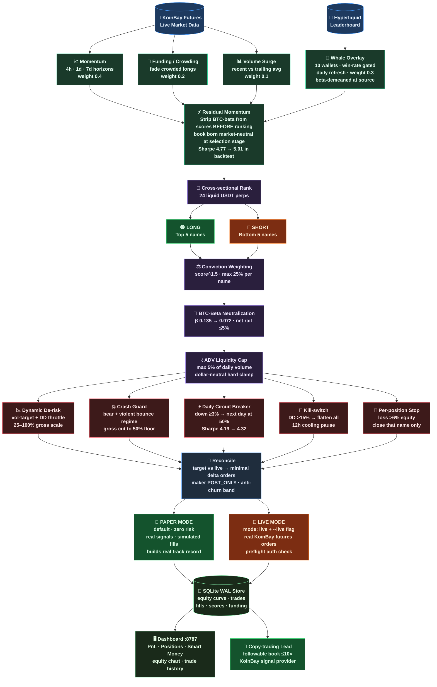

# Sentinel Edge — KoinBay Copy-Trading Bot

> Market-neutral long/short crypto futures strategy, modeled on Gamma's **Sentiment Edge** vault.  
> Runs on **KoinBay futures**. Goal: become a **copy-trading lead** (signal provider).

---

## Architecture



---

## Backtest Results (Jan → Jun 2026, real KoinBay daily data)

| Metric | Value |
|---|---|
| Net return | **+48.4%** |
| Sharpe ratio | **~5.0** |
| Max drawdown | ~12.6% |
| Worst month | ~−2.5% |
| Book BTC-beta | **0.07** (near-zero) |
| Trades | 503 closed round-trips |

> ⚠️ Backtest caveats: survivorship bias, assumes maker fills, no historical whale/funding data.
> Relative improvements between configs are robust; absolute returns are optimistic.

---

## Signal Stack

```
Raw KoinBay data
      │
      ├─ Momentum (40%)   risk-adjusted cross-sectional, horizons: 1d / 3d / 7d / 14d
      ├─ Funding  (20%)   z(-currentFundRate) — fade crowded longs (contrarian)
      ├─ Volume   (10%)   recent surge vs trailing baseline
      └─ Whales   (30%)   blended net positioning from 10 top Hyperliquid wallets
                           (win-rate gated, daily refresh, beta-demeaned at source)
      │
      ▼
  Beta-orthogonalization → residual scores (strip BTC-beta before ranking)
      │
      ▼
  Cross-sectional z-score → continuous rank → long top-5 / short bottom-5
```

---

## Safety Model

| Layer | What it does |
|---|---|
| Paper mode (default) | Real signals, simulated fills — zero funds at risk |
| Net-rail clamp | `\|net\|/equity` hard-clamped to ≤5% every cycle |
| Beta-hedge | Post-construction BTC-beta neutralization |
| Dynamic de-risk | Vol-targeting + drawdown throttle cuts gross 25–100% |
| Crash guard | Bear + violent-bounce regime → additional gross cut |
| Daily circuit-breaker | Day down ≥3% → next day runs at 50% gross |
| Kill-switch | Drawdown >15% → flatten all + 12h pause |
| Per-position stop | Single name loss >6% equity → close it |

---

## Quick Start

```bash
# 1. Install
python3 -m venv .venv && source .venv/bin/activate
pip install -r requirements.txt

# 2. Configure
cp .env.example .env      # add KOINBAY_API_KEY + KOINBAY_API_SECRET

# 3. Run (paper mode — safe)
python run.py selftest    # verify connection + print proposed book
python run.py loop        # start the daily rebalance loop
python run.py dashboard   # open dashboard at http://127.0.0.1:8787

# 4. Go live (only after reviewing paper track record)
# set mode: live in config.yaml, then:
python run.py once --live
```

---

## Project Structure

```
GAMMA_SENTIMENTEDGE/
├── config.yaml                    # all strategy knobs (secrets in .env only)
├── run.py                         # CLI entrypoint
├── sentinel                       # shell helper (start/stop/status)
├── src/sentinel/
│   ├── config.py                  # pydantic config + .env overlay
│   ├── exchange/                  # KoinBay client, signing, contract specs
│   ├── signal/
│   │   ├── market_proxy.py        # momentum + funding + volume + whale scorer
│   │   ├── whale_tracker.py       # Hyperliquid top-wallet consensus
│   │   └── whale_select.py        # win-rate-gated wallet screening
│   ├── strategy/
│   │   ├── sentiment_edge.py      # scores → dollar-neutral target book
│   │   ├── sizing.py              # weights, caps, vol-adjust, net-clamp
│   │   └── portfolio.py           # beta math: compute_betas, demean_by_beta, dispersion
│   ├── risk/limits.py             # all risk functions (pure, testable)
│   ├── execution/                 # paper + live broker, reconciler
│   ├── engine/engine.py           # full rebalance pipeline
│   ├── state/store.py             # SQLite WAL store (equity, trades, fills, funding)
│   └── dashboard/server.py        # local web dashboard
├── scripts/
│   ├── backfill.py                # seed dashboard with backtest history
│   └── bt_compare.py             # A/B harness (used to validate every feature)
├── tests/                         # 115 tests
└── docs/KOINBAY_API.md            # live-verified KoinBay API reference
```

---

## Disclaimer

Trading futures is risky. This is software, not financial advice. You are responsible for your keys,
capital, and live orders. Always start in paper mode and review the track record before going live.
